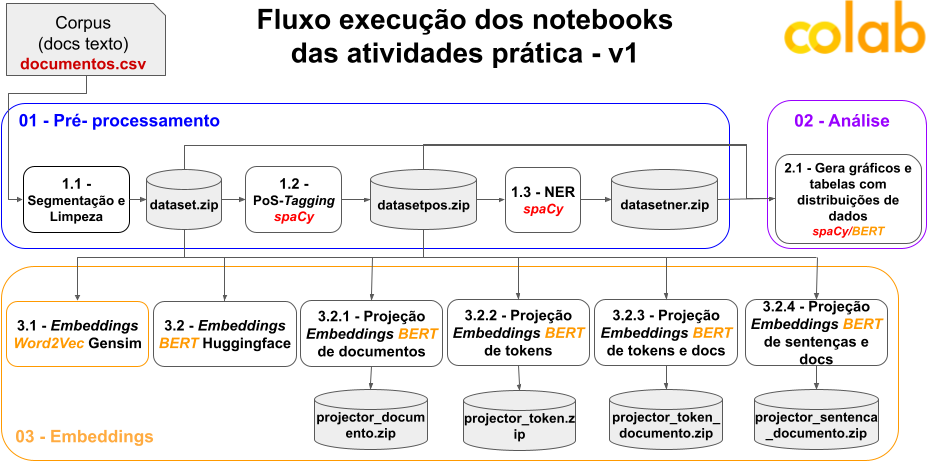

# Tópicos Especiais em Computação: Semântica e Recuperação de Informação

Notebooks Colab das atividades práticas da disciplina de Tópicos Especiais em Computação: Semântica e Recuperação de Informação.

## **Instruções iniciais** 

Para executar os notebooks siga os passos abaixo.
1. Crie a pasta **"Colab Notebooks"** na raiz do seu google drive para receber a pasta do projeto. Outros projetos utilizando Colab Notebooks podem ser criados na mesma pasta.
2. Dentro da pasta **"Colab Notebooks"** crie a pasta **"SRI"** para armazenar e executar os notebooks das atividades práticas da disciplina.
3. Dentro da pasta **"SRI"** crie a pasta **"data"** e coloque o arquivo de dados [**documentos.csv**](https://github.com/osmarbraz/sri/blob/main/data/documentos.csv). Este arquivo é o conjunto de dados utilizados na prática. Cada linha do arquivo é formato por `["id","documento"]`.

Posteriormente os notebooks podem ser executados em ordem sequencial conforme a figura a seguir.

[Apresentação do fluxo de uso dos notebooks e fluxo geral de manipulação de arquivos no Colab.](https://docs.google.com/presentation/d/1W5TRri89JVVyQVGz9IOeQIa9jk186w4c/edit#slide=id.gf4978a6ef2_0_24)

## Notebooks

1. **Pré-processamento**
	- 1.1. [**Segmentacao_Limpeza_v1.ipynb**](https://github.com/osmarbraz/sri/blob/main/1_1_Segmentacao_Limpeza_v1.ipynb) - Realiza a limpeza e segmentação dos documentos.
	- 1.2. [**GerarPOS_v1.ipynb**](https://github.com/osmarbraz/sri/blob/main/1_2_GerarPOS_v1.ipynb) - Gera as PoSTagging do documento utilizando o spaCy.
	- 1.3. [**NER_spaCy_v1.ipynb**](https://github.com/osmarbraz/sri/blob/main/1_3_NER_spaCy_v1.ipynb) - Realiza reconhecimento de entidades nomeadas em textos.

2. **Análise**
	- 2.1. [**AnaliseDados_v1.ipynb**](https://github.com/osmarbraz/sri/blob/main/2_1_AnaliseDados_v1.ipynb) - Gera gráficos e tabelas com distribuições de dados.

3. **Embeddings**
	- 3.1. [**Embeddings_Word2Vec_Gensim_v1.ipynb**](https://github.com/osmarbraz/sri/blob/main/3_1_Embeddings_Word2Vec_Gensim_v1.ipynb) - Examinando embeddings estáticos de palavras gerados com Word2Vec.
	- 3.2. [**Embeddings_BERT_Huggingface_v1.ipynb**](https://github.com/osmarbraz/sri/blob/main/3_2_Embeddings_BERT_Huggingface_v1.ipynb) - Examinando embeddings contextualizados de palavras e sentenças gerados com o BERT.
	
		- 3.2.1. [**GerarArquivosProjecaoEmbeddingsDocumento_v1.ipynb**](https://github.com/osmarbraz/sri/blob/main/3_2_1_GerarArquivosProjecaoEmbeddingsDocumento_v1.ipynb) - Gerando embeddings de documento com o BERT para o Embedding Projector.		
		- 3.2.2. [**GerarArquivosProjecaoEmbeddingsToken_v1.ipynb**](https://github.com/osmarbraz/sri/blob/main/3_2_2_GerarArquivosProjecaoEmbeddingsToken_v1.ipynb) - Gerando embeddings de tokens com o BERT para o Embedding Projector.		
		- 3.2.3. [**GerarArquivosProjecaoEmbeddingsToken_Documento_v1.ipynb**](https://github.com/osmarbraz/sri/blob/main/3_2_3_GerarArquivosProjecaoEmbeddingsToken_Documento_v1.ipynb) - Gerando embeddings de tokens e documentos com o BERT para o Embedding Projector.		
		- 3.2.4. [**GerarArquivosProjecaoEmbeddingsSentenca_Documento_v1.ipynb**](https://github.com/osmarbraz/sri/blob/main/3_2_4_GerarArquivosProjecaoEmbeddingsSentenca_Documento_v1.ipynb) - Gerando embeddings de sentenças e documentos com o BERT para o Embedding Projector.

## Projeções de embeddings

**Links** para os arquivos de configuração das projeções de embeddings no *Embedding Projector*:

- **Documentos:** *config_documento.json*: 
https://projector.tensorflow.org/?config=https://raw.githubusercontent.com/osmarbraz/sri/main/projecao/config_documento.json
- **Tokens:** *config_token.json*: 
https://projector.tensorflow.org/?config=https://raw.githubusercontent.com/osmarbraz/sri/main/projecao/config_token.json
- **Tokens e Documentos:** *config_token_documento.json*: 
https://projector.tensorflow.org/?config=https://raw.githubusercontent.com/osmarbraz/sri/main/projecao/config_token_documento.json
- **Sentenças e Documentos:** *config_sentenca_documento.json*: 
https://projector.tensorflow.org/?config=https://raw.githubusercontent.com/osmarbraz/sri/main/projecao/config_sentenca_documento.json

## Conjunto de dados
O conjunto de dados utilizado pelos notebooks é formado por 20 documentos extraído do conjunto de dados CSTNews. 

* [**documentos.csv**](https://github.com/osmarbraz/sri/blob/main/data/documentos.csv)

Clique aqui para acesssar o conjunto de dados completo [**CSTNews**](https://sites.icmc.usp.br/taspardo/sucinto/files/CSTNews%206.0.zip). 

**Referência**
- ALEIXO, Priscila; PARDO, Thiago Alexandre Salgueiro. CSTNews: um córpus de textos jornalísticos anotados segundo a teoria discursiva multidocumento CST (Cross-document Structure Theory), 2008.

## Documentação Google Colaboratory

**Guia Colab Iniciante:**
https://medium.com/machina-sapiens/google-colab-guia-do-iniciante-334d70aad531

**Documentação oficial:**
https://colab.research.google.com/github/jakevdp/PythonDataScienceHandbook/blob/master/notebooks/01.01-Help-And-Documentation.ipynb
 
**Características :**
https://colab.research.google.com/notebooks/basic_features_overview.ipynb
